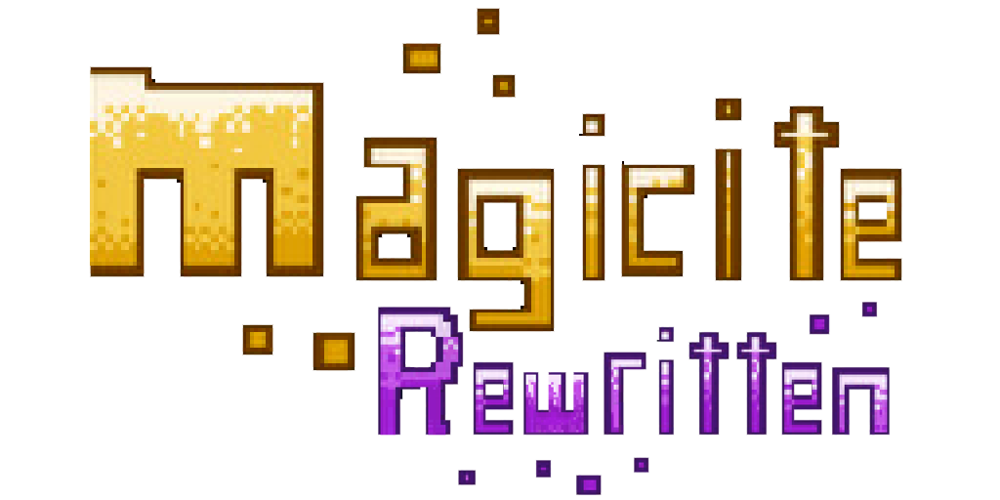

Welcome to Magicite Rewritten!  This is a fan-lead overhaul mod of the game Magicite.  Magicite is a special gem of a game developed by Sean Young and released on Steam in 2014.  You can find the original game here: https://store.steampowered.com/app/268750/Magicite/

Since its original release, some of the underlying technologies have become dated and make it difficult to play with friends.  This fan led project seeks to restore the original so that many more can play the game!

Here are some of our goals:
- Moving to a modern Unity version.
- Adding Cloud Saves
- Steam compatible multiplayer
- Re-balancing
- Adding New/Unreleased Content
- Mod support

## Release Plan

As fans, we recognize there is a line between originality and copyright. Our intent is to help more people play and enjoy the game. While we are putting a lot of our own work into this, the bulk of the assets belong to Sean. As such, our project will be released as free patch files via the release tab on this GitHub page. Players must own Magicite and then will apply our patch over top of the original code. **_We do not endorse obtaining the original Magicite any other way than a legal purchase._**

## Project Roadmap

We have a publicly visible project tracking our progress. You can find it here:  https://github.com/users/kateisprettydamngreat/projects/4

In the future, this will be the best place to report bugs (as well as on the discord server).

## FAQ

When will the first release be?
- No idea :sweat_smile:  We'll try and keep the project board up to date on our progress but this is a community project entirely at the whims of availability so please be patient with us.

I have a bug that I found in the current Magicite that I'd like to see fixed in Rewritten.
- We definitely want to hear about it and make sure it gets addressed. Let us know in discord.

I have a new idea I'd like to see added.
- Nice! Definitely drop it in our discord. No promises on implementing anything, but we're always open to new ideas. One of our hopes is that with Rewritten there will be added support for people creating mods overtop of ours.

## Community

We have a discord! https://discord.gg/bcHxcJdF5
(dm k8rgrl on discord if invite expires)

## Cross-Promotion: Scourgefall

If you are here, you likely enjoyed the Magicite formula. We recommend that you also check out our friends over at the Scourgefall project! They are doing a truly new project from the ground up using a similar formal to the original. Find their discord at: https://discord.gg/x7C3yNBUH8

# For deephaven!
